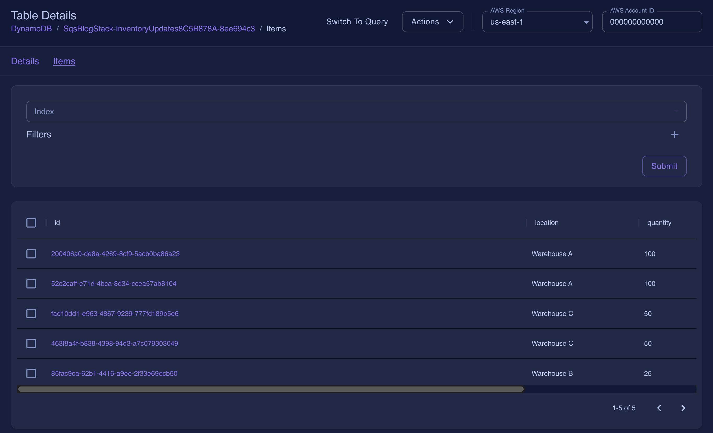

# Event-driven architecture with SQS, Lambda, and DynamoDB

| Key          | Value                                                                               |
| ------------ | ----------------------------------------------------------------------------------- |
| Environment  | LocalStack, AWS                                                                     |
| Services     | SQS, DynamoDB, Lambda, S3                                                           |
| Integrations | CDK                                                                                 |
| Categories   | Serverless; Event-driven architecture                                               |
| Level        | Intermediate                                                                        |
| GitHub       | [Repository link](https://github.com/localstack-samples/sample-sqs-lambda-dynamodb) |

## Introduction

The Event-driven architecture with SQS, DynamoDB, Lambda, and S3 demonstrates an inventory management system that streamlines inventory operations and ensure accurate inventory levels. The sample application implements the following:

- CSV files are uploaded to an S3 bucket, thus consolidating and securing the inventory data for the inventory management system's access.
- A Lambda function is utilized to read and parse the CSV file, extracting individual inventory update records.
- Each record is transformed into a message and sent to an SQS queue. Another Lambda function continually polls the SQS queue for new messages.
- Upon receiving a message, it retrieves the inventory update details and updates the inventory levels in DynamoDB accordingly.

Users can deploy this application on LocalStack and AWS with no changes using Cloud Development Kit (CDK). To test this application sample, we will demonstrate how you use LocalStack to deploy the infrastructure on your developer machine and your CI environment. Furthermore, we will showcase how you can check out the event-driven architecture using LocalStack Web Application.

## Architecture diagram

The following diagram shows the architecture that this sample application builds and deploys:


We are using the following AWS services and their features to build our infrastructure:

- [SQS](https://docs.localstack.cloud/user-guide/aws/sqs/) as a distributed message queuing service to decouple the inventory update records from the inventory management system.
- [DynamoDB](https://docs.localstack.cloud/user-guide/aws/dynamodb/) as a key-value and document database to update the inventory levels for each product.
- [Lambda](https://docs.localstack.cloud/user-guide/aws/lambda/) as a serverless compute service to process the inventory update records and update the inventory levels in DynamoDB.
- [S3](https://docs.localstack.cloud/user-guide/aws/s3/) as an object storage service to store the inventory update records.

## Prerequisites

- LocalStack Pro with the [`localstack` CLI](https://docs.localstack.cloud/getting-started/installation/#localstack-cli).
- [Cloud Development Kit (CDK)](https://docs.aws.amazon.com/cdk/latest/guide/getting_started.html) installed with the [`cdklocal` wrapper](https://docs.localstack.cloud/user-guide/integrations/aws-cdk/).
- [AWS CLI](https://docs.localstack.cloud/user-guide/integrations/aws-cli/) with the [`awslocal` wrapper](https://docs.localstack.cloud/user-guide/integrations/aws-cli/#localstack-aws-cli-awslocal).
- [Node.js](https://nodejs.org/en/) with the `npm` package manager.
- [Python 3.8.0](https://www.python.org/downloads/release/python-380/) in the `PATH`

Start LocalStack Pro with the `LOCALSTACK_API_KEY` pre-configured:

```shell
export LOCALSTACK_API_KEY=<your-api-key>
DEBUG=1 localstack start
```

We specified `DEBUG=1` to get the printed LocalStack logs directly in the terminal to help us see the event-driven architecture in action. If you prefer running LocalStack in detached mode, you can add the `-d` flag to the `localstack start` command, and use Docker Desktop to view the logs.

## Instructions

### Installing the dependencies

You can create a Python virtual environment using `virtualenv` with the following command:

```shell
python3 -m venv .venv
```

After initializing the virtual environment, activate it using the following command:

```shell
source .venv/bin/activate # Linux/macOS
.venv\Scripts\activate.bat # Windows
```

You can now install the required dependencies using the following command:

```shell
pip install -r requirements.txt
```

### Deploying the application

To create the AWS infrastructure locally, you can use CDK and our `cdklocal` wrapper.

```shell
cdklocal bootstrap
cdklocal deploy
```
This will deploy the `SqsBlogStack` stack. You will see the following output:

```bash
Outputs:
SqsBlogStack.S3BucketName = sqsblogstack-inventoryupdatesbucketfe-54927c8a
Stack ARN:
arn:aws:cloudformation:us-east-1:000000000000:stack/SqsBlogStack/8de4814d

✨  Total time: 35.17s
```

The `SqsBlogStack.S3BucketName` output is the name of the S3 bucket that we will use to upload the CSV file. This would be different for you.

### Testing the application

You can copy the `sqs_blog/sample_file.csv` file to the S3 bucket to trigger the event-driven architecture. You can use the following AWS CLI command to copy the file to the S3 bucket:

```shell
BUCKET_NAME=$(awslocal s3 ls | grep sqsblogstack-inventoryupdatesbucketfe | awk '{print $3}')
awslocal s3 cp sqs_blog/sample_file.csv s3://$BUCKET_NAME
```

You can now navigate to the [LocalStack Web Application](https://app.localstack.cloud) and the [DynamoDB Resource Browser](https://app.localstack.cloud/inst/default/resources/dynamodb).

Click on the **SqsBlogStack-InventoryUpdates-*** table to view the inventory updates. You can view the items by switching to scan, selecting the index, and clicking **Submit**. You will see the following:



### GitHub Action

This application sample hosts an example GitHub Action workflow that starts up LocalStack, builds the Lambda functions, and deploys the infrastructure on the runner. You can find the workflow in the `.github/workflows/main.yml` file. To run the workflow, you can fork this repository and push a commit to the  `main` branch.

Users can adapt this example workflow to run in their own CI environment. LocalStack supports various CI environments, including GitHub Actions, CircleCI, Jenkins, Travis CI, and more. You can find more information about the CI integration in the [LocalStack documentation](https://docs.localstack.cloud/user-guide/ci/).

## Contributing

We appreciate your interest in contributing to our project and are always looking for new ways to improve the developer experience. We welcome feedback, bug reports, and even feature ideas from the community. Refer to the [contributing guide](CONTRIBUTING.md) for more details on how to get started.
